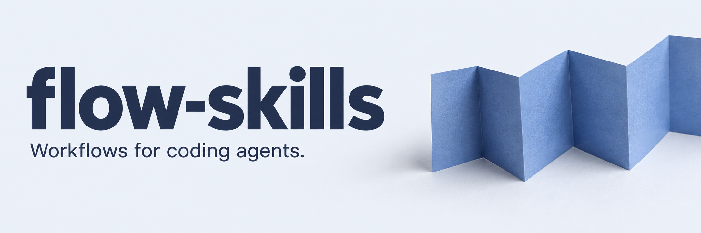

[](docs/SKILLS.md)
[](https://agentskills.io/specification)
[](https://github.com/vercel-labs/skills)
[](https://skills.sh)
[](LICENSE)
[](https://github.com/emiliodominguez/flow-skills/commits/main)

[Install](#quick-start) &nbsp; / &nbsp; [Skills](#pick-a-skill) &nbsp; / &nbsp; [Profiles](#profiles) &nbsp; / &nbsp; [Docs](#documentation)

<br>

**flow-skills** is a set of 37 [Agent Skills](https://agentskills.io) for the work around writing code:
exploring an idea, planning a change, building it, reviewing it and shipping it.

Each skill is a plain `SKILL.md` folder. Install the ones you need in any agent that supports
the open specification. Small descriptions stay in context; detailed guidance loads when needed.

## Quick start

```sh
npx skills add emiliodominguez/flow-skills
```

Pick your skills and agents in the installer. Then give your agent a task:

```text
flow-work Fix the cart total so it accounts for quantity.
Add a regression test, run the relevant checks, and leave the diff for review.
```

Use your agent's invocation syntax if it requires one. You can also describe the task naturally;
skill selection and behavior depend on the agent and model.

<sub>Requires Node.js 22.20.0+ for the <a href="https://github.com/vercel-labs/skills/blob/main/package.json">skills CLI</a>. Working on this repository? Use Node.js 24, pinned in <a href=".nvmrc">.nvmrc</a>.</sub>

<br>

## The workflow

**Start with the smallest flow that gets the job done.** A bounded fix can begin at `flow-work`.
A feature with more moving parts can follow the whole path:

|            | Skill                                       | What moves forward                                         |
| ---------- | ------------------------------------------- | ---------------------------------------------------------- |
| **Plan**   | [`flow-plan`](docs/skills/flow-plan.md)     | A source-grounded plan with scope and acceptance criteria. |
| **Build**  | [`flow-work`](docs/skills/flow-work.md)     | Working changes, checked against the plan.                 |
| **Review** | [`flow-review`](docs/skills/flow-review.md) | Findings backed by evidence from the actual diff.          |
| **Ship**   | [`flow-ship`](docs/skills/flow-ship.md)     | Delivery to the Git or review stage you requested.         |

For dependent tasks, `flow-orchestrate` coordinates the work and `flow-verify` checks each gate:
**`ACCEPT`**, **`REJECT`** or **`BLOCKED`**. Handoffs preserve decisions and evidence so another session
can pick up where you left off.

[Read the workflow guide](docs/OVERVIEW.md) or [see how the skills connect](docs/SKILL-MAP.md).

> Skills are instructions. Installing one starts no process, registers no agent and grants no permission.
> You choose how far the work goes.

<br>

## Pick a skill

Start with the job in front of you.

| The job               | The starting point                                                                                                                             |
| --------------------- | ---------------------------------------------------------------------------------------------------------------------------------------------- |
| Explore an idea       | [`flow-brainstorm`](docs/skills/flow-brainstorm.md) to explore; [`flow-prototype`](docs/skills/flow-prototype.md) to try it.                   |
| Make a change         | [`flow-work`](docs/skills/flow-work.md) for a bounded task; [`flow-plan`](docs/skills/flow-plan.md) when it needs a plan.                      |
| Build an interface    | [`flow-design`](docs/skills/flow-design.md) for direction; [`flow-ui`](docs/skills/flow-ui.md) to build it.                                    |
| Investigate a failure | [`flow-triage`](docs/skills/flow-triage.md) to assess impact; [`flow-diagnose`](docs/skills/flow-diagnose.md) to find the cause.               |
| Review the code       | [`flow-review`](docs/skills/flow-review.md) for correctness; [`flow-adversarial-review`](docs/skills/flow-adversarial-review.md) for security. |
| Deliver the work      | [`flow-ship`](docs/skills/flow-ship.md) for delivery; [`flow-release`](docs/skills/flow-release.md) for a versioned release.                   |

<details>
<summary><strong>Browse the rest of the toolkit</strong></summary>

| When you need to...                                       | Use                                                  |
| --------------------------------------------------------- | ---------------------------------------------------- |
| Understand an unfamiliar repository                       | `flow-onboard`, `flow-repo-brief`                    |
| Coordinate dependent work with independent checks         | `flow-orchestrate`, `flow-verify`, `flow-specialize` |
| Add meaningful tests                                      | `flow-test`                                          |
| Improve structure or remove complexity                    | `flow-refactor`, `flow-simplify`                     |
| Design an API or instrument a service                     | `flow-api`, `flow-observe`                           |
| Upgrade dependencies, migrate code or measure performance | `flow-deps`, `flow-migrate`, `flow-benchmark`        |
| Change database schemas or backfill live data             | `flow-data-migrate`                                  |
| Tune styling, motion or accessibility                     | `flow-styles`, `flow-animate`, `flow-a11y`           |
| Upgrade an existing interface                             | `flow-redesign`                                      |
| Author a commit, repair Git or address PR feedback        | `flow-commit`, `flow-git-fix`, `flow-pr-fix`         |
| Write documentation                                       | `flow-docs`                                          |
| Save work for the next session                            | `flow-handoff`                                       |
| Tidy your agent setup or improve a skill                  | `flow-prune-agent-setup`, `flow-write-skill`         |

[Open the full catalog](docs/SKILLS.md) for every description and skill page.

</details>

<details>
<summary><strong>Copy a prompt and try it</strong></summary>

**Turn an idea into a plan**

```text
flow-plan Add account export. Inspect the existing data model, define acceptance
criteria and non-goals, and break the work into changes we can verify.
```

**Polish an existing interface**

```text
flow-redesign Improve the settings page's hierarchy, spacing and responsive layout.
Preserve its content, URLs and behavior. Verify the result in the browser.
```

**Review before committing**

```text
flow-review Review the current diff for correctness and regressions.
Ground each finding in the code and report what you actually checked.
```

These are starting prompts, not recorded results. The [everyday examples](docs/EXAMPLES.md) work
through a bug fix, dependency upgrade and disputed review feedback with concrete artifacts and stopping points.

</details>

<br>

## Profiles

Install a focused slice of the suite, or combine profiles.
From a clone:

```sh
./install.sh --profile core --profile review -- -a codex -y
```

Replace `codex` with your agent id. The wrapper defaults to user scope; use `--project` for a project install.
Pass an explicit `-a` list after `--` to avoid the [global-install issue](#promptscript-error-during-a-global-install).

<details>
<summary><strong>See the six profiles and their skills</strong></summary>

Skill names below omit the `flow-` prefix. Membership is defined in [`profiles.json`](profiles.json).

| Profile         | Skills                                                                                                          |
| --------------- | --------------------------------------------------------------------------------------------------------------- |
| `core`          | plan, work, test, review, commit, ship, release, handoff                                                        |
| `orchestration` | plan, orchestrate, verify, repo-brief, specialize, work, review, handoff                                        |
| `frontend`      | design, ui, styles, animate, a11y, redesign, prototype                                                          |
| `review`        | review, adversarial-review, simplify, refactor                                                                  |
| `backend`       | api, observe, benchmark, adversarial-review, migrate, deps, data-migrate                                        |
| `maintenance`   | deps, diagnose, triage, benchmark, refactor, simplify, migrate, git-fix, pr-fix, prune-agent-setup, write-skill |

</details>

### Install options

<details>
<summary><strong>Specific agents, individual skills, updates and removal</strong></summary>

| Goal                                | Command                                                                  |
| ----------------------------------- | ------------------------------------------------------------------------ |
| Pick skills and agents in a prompt  | `npx skills add emiliodominguez/flow-skills`                             |
| Install for your user, not the repo | `npx skills add emiliodominguez/flow-skills -g -a <agent> -y`            |
| Target specific agents, no prompts  | `npx skills add emiliodominguez/flow-skills -a <agent>... -y`            |
| Install specific skills             | `npx skills add emiliodominguez/flow-skills --skill flow-plan flow-work` |
| See what is available               | `npx skills add emiliodominguez/flow-skills --list`                      |
| Update or remove later              | `npx skills update` / `npx skills remove`                                |

Agent ids come from the [skills CLI](https://github.com/vercel-labs/skills). You can also copy any
`skills/<name>/` folder into your agent's skills directory by hand.

<a id="more-options"></a>

**From a clone**

The wrappers accept profiles and pass everything after `--` to `npx skills`:

```sh
./install.sh --project -- -a codex -y  # current project, one agent
./install.sh --local -- -a codex -y    # install from your clone
./uninstall.sh --dry-run              # preview removal of every flow-* skill
./uninstall.sh --profile frontend     # remove a single profile
```

Both scripts first remove leftovers from the retired `agent-skills` installer: the old `ed-*`
symlinks and marked copies. `./uninstall.sh --legacy-only` does only that. See the
[migration notes](docs/PRACTICES.md#migration-from-agent-skills-ed-).

The `.claude-plugin/` folder is an optional marketplace channel for agents that read that format.
Plugin managers usually namespace skill names; `npx skills` is the recommended install path.

</details>

<a id="promptscript-error-during-a-global-install"></a>

<details>
<summary><strong>Troubleshooting: PromptScript error during a global install</strong></summary>

If you see `PromptScript does not support global skill installation`, select your agents explicitly:

```sh
npx skills add emiliodominguez/flow-skills -g -a codex -y
```

Replace `codex` with your agent id, or list several, such as `-a claude-code codex cursor`.
To select every skill, use `--skill '*'`. Avoid `--all` and `-a '*'` for global installs:
they select project-only agents too, and `--all` overrides an explicit agent list.

This is an [upstream skills CLI issue](https://github.com/vercel-labs/skills/issues/1496), reproduced
with version 1.7.0 on 2026-09-27. Automatic agent selection can include PromptScript even when it is
not installed. PromptScript supports project installs only. Other selected agents can still receive
the skills, and the CLI can print `Done!` and exit successfully despite reporting failed targets.
Check the installation results or run `npx skills list -g` before assuming everything failed.

If you use PromptScript, install in your project without `-g`:

```sh
npx skills add emiliodominguez/flow-skills -a promptscript -y
```

</details>

<br>

## Documentation

| Use the suite                                                                                  | Work on the suite                                                                              |
| ---------------------------------------------------------------------------------------------- | ---------------------------------------------------------------------------------------------- |
| [**Workflow**](docs/OVERVIEW.md)<br>Choose a flow. Understand contracts and evidence.          | [**Authoring**](docs/AUTHORING.md)<br>Write a focused, portable skill.                         |
| [**Everyday examples**](docs/EXAMPLES.md)<br>Start with a concrete task and a copyable prompt. | [**Architecture**](docs/ARCHITECTURE.md)<br>Explore the repo and its validation rules.         |
| [**Skills catalog**](docs/SKILLS.md)<br>Every skill, with a full page for each.                | [**Design notes**](docs/PRACTICES.md)<br>Sources, compatibility, context budget and migration. |
| [**Orchestration**](docs/ORCHESTRATION.md)<br>Follow a gated, resumable multi-step run.        | [**Evaluations**](evals/README.md)<br>See what the checks prove and run agent scenarios.       |

### Contributing

```sh
pnpm install --frozen-lockfile
pnpm check
```

The gate checks formatting, lint, types, skill validation, tests and generated docs.
See [CONTRIBUTING.md](CONTRIBUTING.md) for the authoring workflow and changesets.

<br>

---

### License

[MIT](LICENSE). See the [changelog](CHANGELOG.md) for released versions.
