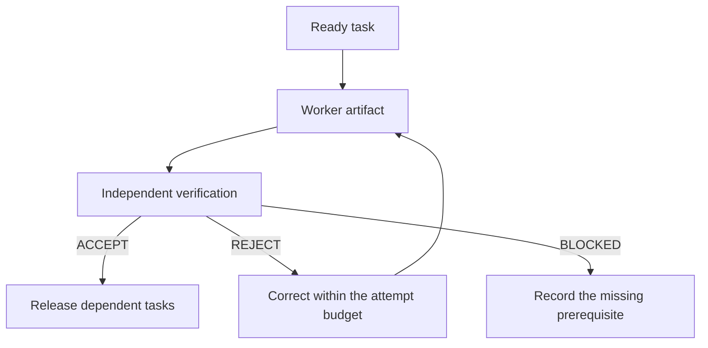

# The workflow

Pick the smallest flow that still ends in something you can check. The suite keeps exploring,
building and verifying separate, but it never forces a new session or a fixed panel of agents.

## Choose a flow

| Situation                                   | Flow                                                             |
| ------------------------------------------- | ---------------------------------------------------------------- |
| Small, well-understood change               | `flow-work`, with evidence that fits the change                  |
| The outcome is still unclear                | `flow-brainstorm`, optionally `flow-prototype`, then `flow-plan` |
| Unfamiliar repository                       | `flow-onboard`, then a task-specific `flow-repo-brief` if useful |
| Several steps, one executor                 | `flow-plan`, then `flow-work`                                    |
| Dependent steps that need independent gates | `flow-plan`, then `flow-orchestrate` with `flow-verify`          |
| Agents keep missing local conventions       | `flow-repo-brief`, then `flow-specialize`                        |
| Review only                                 | `flow-review` or `flow-adversarial-review`, ending with findings |
| Delivery the user already asked for         | `flow-commit` or `flow-ship`, up to the requested stage          |

## Contracts and evidence

Every task states its outcome, the files it owns, its dependencies, acceptance criteria, the
evidence required and when to stop. Workers produce artifacts; a verifier decides whether the
current artifact meets the gate.

- **Pragmatic** verification suits decision artifacts such as research or a design choice.
- **Production** verification applies to shipped code: behavior, repository checks and runtime evidence.
- **Independence** needs a separate agent or a fresh context. Two personas in one context are still one reviewer.
- **Parallel work** needs independent tasks, disjoint files, and a combined check afterward.

## Continuity

- A plan works in the same session or a new one; the user's latest instructions always win.
- Handoffs keep source revisions, evidence, decisions, pending work and attempts already used.
- A changed input invalidates only the acceptance that depended on it.
- A git-ignored artifact stays on the machine that wrote it unless someone shares it.

## Keep the install small

Every installed skill's description sits in the agent's context. Install a
[profile](../profiles.json) when you only need part of the workflow. See the
[catalog](SKILLS.md), the [handoff map](SKILL-MAP.md) and the [orchestration example](ORCHESTRATION.md).
