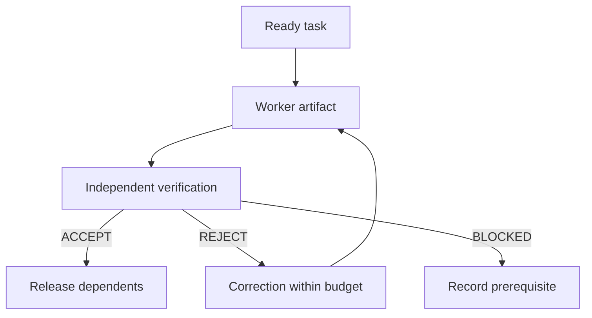

# The workflow

Choose the smallest workflow that has a checkable outcome. The suite separates exploration,
execution and verification without forcing a new session or a fixed agent panel.

| Situation                                | Flow                                                          |
| ---------------------------------------- | ------------------------------------------------------------- |
| Small understood change                  | `ed-work` with relevant evidence                              |
| Unclear outcome                          | `ed-brainstorm`, optionally `ed-prototype`, then `ed-plan`    |
| Unfamiliar repository                    | `ed-onboard`, then a task-specific `ed-repo-brief` if useful  |
| Multi-step direct work                   | `ed-plan` then `ed-work`                                      |
| Dependent work needing independent gates | `ed-plan` then `ed-orchestrate` with `ed-verify`              |
| Repeated mismatch with local conventions | `ed-repo-brief` then `ed-specialize`                          |
| Review-only request                      | `ed-review` or `ed-adversarial-review`, ending with findings  |
| Already authorized delivery              | `ed-commit` / `ed-ship` through the requested terminal action |

## Contracts and evidence

A task defines its outcome, owned files, dependencies, acceptance criteria, evidence and stop
conditions. Workers return artifacts. An independent verifier decides whether a required gate
accepts the current artifact. Pragmatic verification is appropriate for decision artifacts;
production code uses production criteria and required repository checks.

An available subagent capability and applicable authorization are prerequisites for claiming
independent verification. Running two personas in one context is still one reviewer. Parallel
workers need independent tasks, disjoint writes and integrated verification afterward.

## Continuity

A plan can be used in the same session or a fresh session. Current user steering remains
binding. Handoffs preserve source revisions, evidence, decisions, pending work and attempts
already consumed. Changed inputs invalidate affected acceptance, not every unrelated result.
An ignored artifact stays local unless it is actually shared.

## Keep adoption selective

Use profiles to limit the discovery surface. The original 24 skills retain their names;
four added workflows provide orchestration, verification, repository briefs and specialization.
See [the catalog](SKILLS.md), [handoff table](SKILL-MAP.md), [worked orchestration example](ORCHESTRATION.md)
and [current-practices notes](PRACTICES.md).
