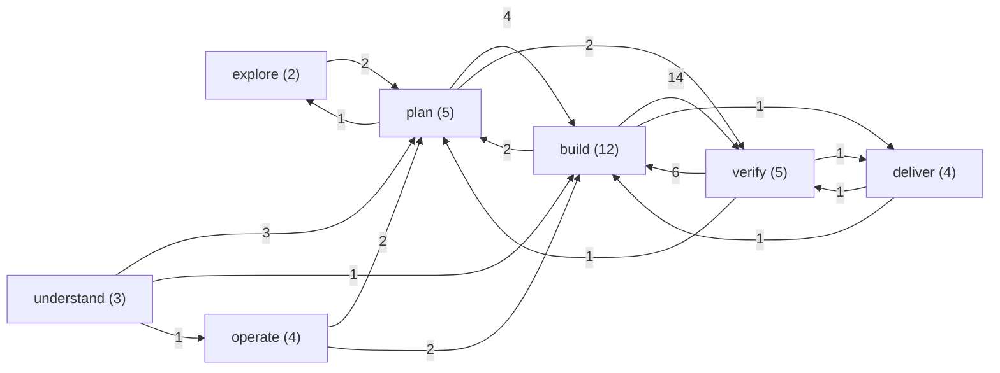
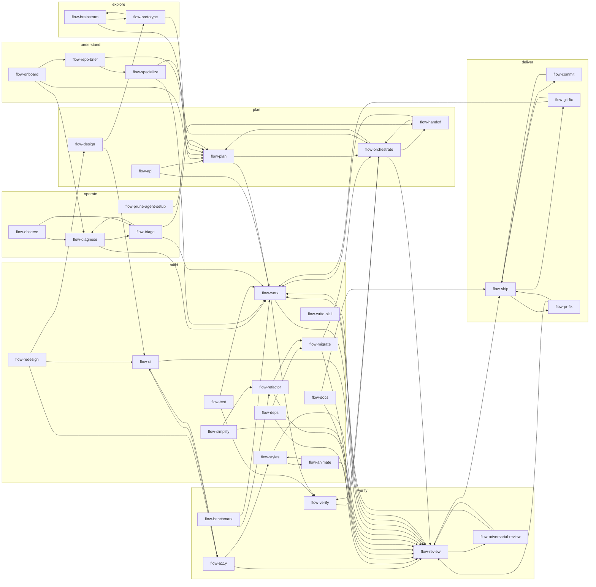

# Skill graph

> Generated by `pnpm docs:gen` from `skills/*/SKILL.md` - do not edit by hand.

How the skills hand off to one another, like a task graph. Edges come from each skill's
handoff clause (`hands off to`, `hands back to`, `routes to` or `feeds`), and groups come from
each skill's `metadata.stage`. Every skill page also shows its own neighborhood.
For the phase tour, see [OVERVIEW.md](OVERVIEW.md).

## Stages

35 skills, 74 handoffs. Edge labels count the handoffs between two stages.

## Every handoff

Show the full skill graph

## Table

| Skill | Stage | Comes from | Hands off to |
| --- | --- | --- | --- |
| [flow-a11y](skills/flow-a11y.md) | verify | `flow-redesign`, `flow-ui` | `flow-ui`, `flow-styles`, `flow-review` |
| [flow-adversarial-review](skills/flow-adversarial-review.md) | verify | `flow-review` | `flow-work`, `flow-review` |
| [flow-animate](skills/flow-animate.md) | build | `flow-styles` | `flow-styles`, `flow-review` |
| [flow-api](skills/flow-api.md) | plan | - | `flow-plan`, `flow-work` |
| [flow-benchmark](skills/flow-benchmark.md) | verify | - | `flow-work`, `flow-refactor` |
| [flow-brainstorm](skills/flow-brainstorm.md) | explore | `flow-prototype` | `flow-prototype`, `flow-plan` |
| [flow-commit](skills/flow-commit.md) | deliver | `flow-ship` | `flow-ship` |
| [flow-deps](skills/flow-deps.md) | build | - | `flow-review`, `flow-migrate` |
| [flow-design](skills/flow-design.md) | plan | `flow-redesign` | `flow-ui`, `flow-prototype` |
| [flow-diagnose](skills/flow-diagnose.md) | operate | `flow-observe`, `flow-onboard`, `flow-triage` | `flow-work`, `flow-triage` |
| [flow-docs](skills/flow-docs.md) | build | - | `flow-review`, `flow-ship` |
| [flow-git-fix](skills/flow-git-fix.md) | deliver | `flow-ship` | `flow-work`, `flow-ship` |
| [flow-handoff](skills/flow-handoff.md) | plan | `flow-orchestrate`, `flow-prune-agent-setup` | `flow-orchestrate`, `flow-work` |
| [flow-migrate](skills/flow-migrate.md) | build | `flow-deps`, `flow-refactor` | `flow-review`, `flow-orchestrate` |
| [flow-observe](skills/flow-observe.md) | operate | - | `flow-triage`, `flow-diagnose` |
| [flow-onboard](skills/flow-onboard.md) | understand | - | `flow-plan`, `flow-diagnose`, `flow-repo-brief` |
| [flow-orchestrate](skills/flow-orchestrate.md) | plan | `flow-handoff`, `flow-migrate`, `flow-plan`, `flow-specialize`, `flow-verify` | `flow-plan`, `flow-verify`, `flow-review`, `flow-handoff` |
| [flow-plan](skills/flow-plan.md) | plan | `flow-api`, `flow-brainstorm`, `flow-onboard`, `flow-orchestrate`, `flow-prototype`, `flow-repo-brief`, `flow-triage` | `flow-work`, `flow-orchestrate` |
| [flow-pr-fix](skills/flow-pr-fix.md) | deliver | `flow-ship` | `flow-review`, `flow-ship` |
| [flow-prototype](skills/flow-prototype.md) | explore | `flow-brainstorm`, `flow-design` | `flow-brainstorm`, `flow-plan` |
| [flow-prune-agent-setup](skills/flow-prune-agent-setup.md) | operate | - | `flow-handoff` |
| [flow-redesign](skills/flow-redesign.md) | build | - | `flow-design`, `flow-ui`, `flow-a11y` |
| [flow-refactor](skills/flow-refactor.md) | build | `flow-benchmark`, `flow-simplify` | `flow-review`, `flow-migrate` |
| [flow-repo-brief](skills/flow-repo-brief.md) | understand | `flow-onboard` | `flow-plan`, `flow-specialize` |
| [flow-review](skills/flow-review.md) | verify | `flow-a11y`, `flow-adversarial-review`, `flow-animate`, `flow-deps`, `flow-docs`, `flow-migrate`, `flow-orchestrate`, `flow-pr-fix`, `flow-refactor`, `flow-simplify`, `flow-styles`, `flow-ui`, `flow-work`, `flow-write-skill` | `flow-work`, `flow-adversarial-review`, `flow-ship` |
| [flow-ship](skills/flow-ship.md) | deliver | `flow-commit`, `flow-docs`, `flow-git-fix`, `flow-pr-fix`, `flow-review` | `flow-commit`, `flow-pr-fix`, `flow-git-fix` |
| [flow-simplify](skills/flow-simplify.md) | build | - | `flow-review`, `flow-refactor` |
| [flow-specialize](skills/flow-specialize.md) | understand | `flow-repo-brief` | `flow-orchestrate`, `flow-work` |
| [flow-styles](skills/flow-styles.md) | build | `flow-a11y`, `flow-animate` | `flow-animate`, `flow-review` |
| [flow-test](skills/flow-test.md) | build | - | `flow-work`, `flow-verify` |
| [flow-triage](skills/flow-triage.md) | operate | `flow-diagnose`, `flow-observe` | `flow-diagnose`, `flow-work`, `flow-plan` |
| [flow-ui](skills/flow-ui.md) | build | `flow-a11y`, `flow-design`, `flow-redesign` | `flow-a11y`, `flow-review` |
| [flow-verify](skills/flow-verify.md) | verify | `flow-orchestrate`, `flow-test`, `flow-work` | `flow-orchestrate` |
| [flow-work](skills/flow-work.md) | build | `flow-adversarial-review`, `flow-api`, `flow-benchmark`, `flow-diagnose`, `flow-git-fix`, `flow-handoff`, `flow-plan`, `flow-review`, `flow-specialize`, `flow-test`, `flow-triage` | `flow-review`, `flow-verify` |
| [flow-write-skill](skills/flow-write-skill.md) | build | - | `flow-review` |
