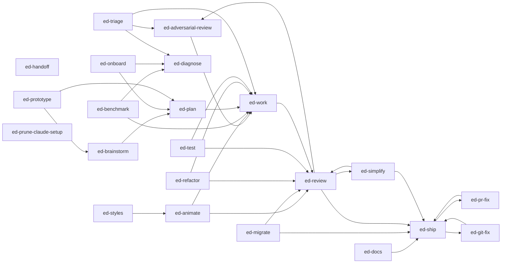

# Skill map

> Generated by `pnpm docs:gen` from `skills/*/SKILL.md` — do not edit by hand.

How the skills hand off to one another. Edges come from each skill's handoff clause
(`hands off to`, `hands back to`, `routes to`, or `feeds`); a few skills are terminal
(they close a loop rather than start the next one). For the phase tour, see [OVERVIEW.md](OVERVIEW.md).

## Handoffs

- **ed-adversarial-review** → `ed-work`
- **ed-animate** → `ed-work`, `ed-review`
- **ed-benchmark** → `ed-diagnose`, `ed-work`
- **ed-brainstorm** → `ed-plan`
- **ed-diagnose** → _(terminal)_
- **ed-docs** → `ed-ship`
- **ed-git-fix** → `ed-ship`
- **ed-handoff** → _(terminal)_
- **ed-migrate** → `ed-review`, `ed-ship`
- **ed-onboard** → `ed-plan`, `ed-diagnose`
- **ed-plan** → `ed-work`
- **ed-pr-fix** → `ed-ship`
- **ed-prototype** → `ed-brainstorm`, `ed-plan`
- **ed-prune-claude-setup** → _(terminal)_
- **ed-refactor** → `ed-work`, `ed-review`
- **ed-review** → `ed-adversarial-review`, `ed-simplify`, `ed-ship`
- **ed-ship** → `ed-pr-fix`, `ed-git-fix`
- **ed-simplify** → `ed-review`, `ed-ship`
- **ed-styles** → `ed-animate`
- **ed-test** → `ed-work`, `ed-review`
- **ed-triage** → `ed-diagnose`, `ed-work`, `ed-adversarial-review`
- **ed-work** → `ed-review`
