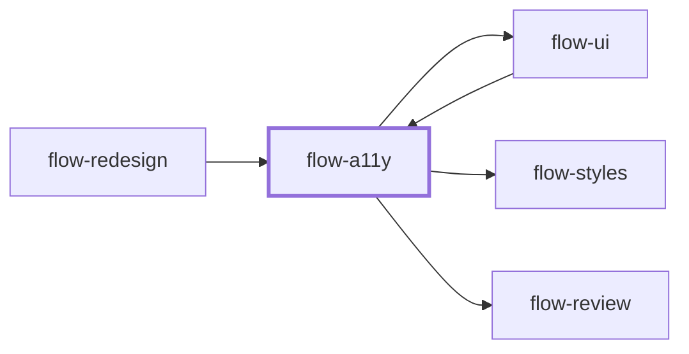

# flow-a11y

> Generated by `pnpm docs:gen` from `skills/flow-a11y/SKILL.md` - do not edit by hand.

_Accessibility audit and fixes to WCAG 2.2 AA. Use when checking keyboard, screen reader, contrast, zoom or reduced-motion compliance, or before releasing UI. Hands off to `flow-ui` or `flow-styles`, then `flow-review`._

**Stage:** verify · [full graph](../SKILL-MAP.md)

---

# Accessibility

Make the interface usable by keyboard, screen reader, magnification, voice and reduced-motion
users. Judge real behavior, not the presence of ARIA. Automated scans find roughly a third of
issues; the rest needs manual checks.

## Phase 1: Scope

- Name the pages, flows and components in scope, the conformance target (default WCAG 2.2 AA),
  supported browsers, and whether the task is audit-only or audit-and-fix.
- Read the component library and design tokens first. A fix belongs in the shared component or
  token, not in one screen's copy.
- Pick representative states: default, hover, focus, error, empty, loading, expanded, modal open,
  long content, narrow viewport, dark mode.

## Phase 2: Test

Run each layer and record what it covered. See [references/wcag-checklist.md](references/wcag-checklist.md)
for the criteria, how to test each, and the 2.2 additions.

1. **Automated:** the project's linter rules plus an axe-style scan of each rendered state. Treat
   results as leads; confirm each one.
2. **Keyboard:** complete every flow with Tab, Shift+Tab, Enter, Space, Escape and arrows. Check
   focus order, a visible focus indicator that isn't hidden under sticky UI, no traps, focus
   return after dialogs and route changes, and a skip link.
3. **Screen reader semantics:** accessible names, roles, states and landmarks from the
   accessibility tree; heading outline; form labels, descriptions and error association; live
   regions for async results. Use a real screen reader when one is available.
4. **Visual:** text contrast 4.5:1 (3:1 for large text), non-text contrast 3:1 for controls and
   focus indicators, meaning not carried by color alone, forced-colors mode.
5. **Zoom and reflow:** 200% text resize and 320 CSS px width without loss of content or
   two-dimensional scrolling, text spacing overrides, orientation.
6. **Input and motion:** target size at least 24x24 CSS px or enough spacing, no drag-only or
   path-based gestures, `prefers-reduced-motion` honored, nothing flashes more than 3 times per second.

## Phase 3: Report and fix

- One finding per issue: criterion, location, affected users, reproduction, evidence (scan
  output, keyboard trace, accessibility-tree excerpt, contrast values) and severity: blocker
  (task impossible), serious, moderate, minor.
- Fix in priority order when authorized. Prefer native elements over ARIA: a `button` beats
  `div role="button"`, and no ARIA beats wrong ARIA. Keep visual design intact; a larger target
  or stronger focus ring can match the existing style.
- Re-test each fix with the method that found it, plus a keyboard pass of the whole flow.

## Anti-patterns

- Claiming conformance from a clean automated scan.
- Adding `aria-label` everywhere, `tabindex` greater than 0, or roles that override native semantics.
- Removing focus outlines for looks, or hiding content that assistive technology still needs.
- Fixing a symptom in one screen while the shared component stays broken.

## Done when

- Every in-scope criterion is marked pass, fail with a finding, or not tested with a reason.
- Authorized fixes are re-tested and don't regress keyboard or visual behavior.
- Manual checks that couldn't run (for example no screen reader) are listed.

Fix through `flow-ui` or `flow-styles`, then `flow-review` the change.

---

Supporting files, loaded on demand:

- [references/wcag-checklist.md](../../skills/flow-a11y/references/wcag-checklist.md)
