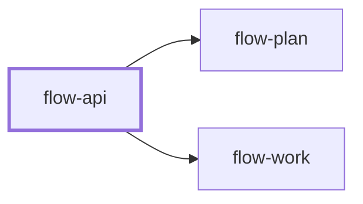

# flow-api

> Generated by `pnpm docs:gen` from `skills/flow-api/SKILL.md` - do not edit by hand.

_API and interface contract design for HTTP, RPC, events, SDKs or module boundaries. Use when adding or changing an endpoint, schema, error model or public interface. Hands off to `flow-plan` or `flow-work`._

**Stage:** plan · [full graph](../SKILL-MAP.md)

---

# API design

Design the contract from the consumer's side, write it down in a machine-checkable form, and
make every change's compatibility explicit. Implementation follows the contract, not the reverse.

## Phase 1: Know the consumers

- Identify each consumer (browser, mobile client, partner, internal service, library user), how
  they deploy, and how long old clients stay in the wild. That sets the compatibility budget.
- Read existing APIs, style guides, schemas and generated clients in the repository. Follow the
  house conventions for naming, casing, pagination, errors and auth even where you would choose
  differently.
- Write two or three real consumer calls first: the request, the response they need, and what
  they do on failure.

## Phase 2: Shape the contract

- **Model:** resources or operations named from the domain, not the database. Small, composable
  operations over one endpoint with many modes.
- **Inputs:** validate at the boundary, reject unknown or malformed input with a specific error,
  and document limits (sizes, ranges, rate).
- **Errors:** one error shape across the surface, with a stable machine-readable code, a human
  message and the field at fault. Distinguish client errors, conflicts, auth failures and retryable
  server failures.
- **Collections:** pagination (keyset or opaque-token for changing data), filtering and sorting with defaults
  and maximums from day one.
- **Writes:** idempotency keys or naturally idempotent operations for anything a client may retry;
  optimistic concurrency where lost updates matter.
- **Security:** authentication, authorization per resource, and no internal identifiers, stack
  traces or secrets in responses.
- **Async and events:** name events in past tense, include a version and an idempotent consumer
  story, and state ordering and delivery guarantees honestly.

## Phase 3: Write it down

Capture the contract in the repository's schema format (for example OpenAPI, a protocol schema,
GraphQL SDL, JSON Schema or exported types) with examples for success and each error class. Lint
and validate it with the project's tooling, and generate clients or types from it when the
repository does.

## Phase 4: Check compatibility

- Classify each change: additive (new optional field, new endpoint), behavioral (same shape, new
  meaning) or breaking (removed or renamed field, new required input, changed type or error).
- Breaking changes need a version, a deprecation window, or an expand, migrate and contract
  sequence. Behavioral changes are breaking for consumers who depend on them.
- Diff the schema against the published version when tooling allows, and add contract tests
  that a consumer would notice failing.

## Anti-patterns

- Exposing database tables or internal types directly as the public contract.
- Different error shapes per endpoint, or success status codes carrying failures.
- Unbounded list endpoints, or retries that create duplicates.
- Silent breaking changes because "no one uses that field".

## Done when

- Consumer calls, the schema and examples agree, and the schema validates.
- Every change is classified, with a migration path for anything breaking.
- Errors, limits, pagination, idempotency and auth are specified, not implied.

Break the implementation into tasks with `flow-plan`, or build a small contract with `flow-work`.
