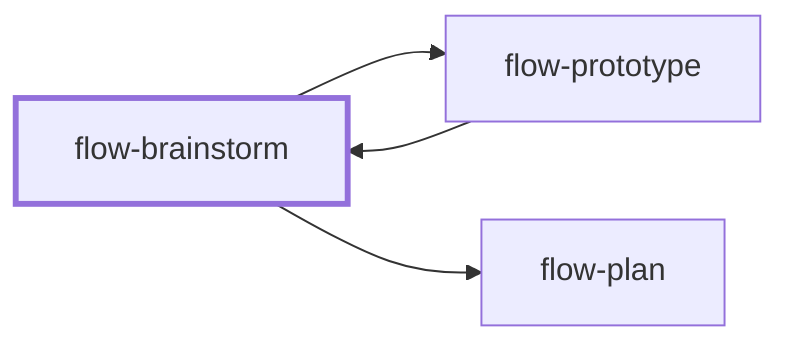

# flow-brainstorm

> Generated by `pnpm docs:gen` from `skills/flow-brainstorm/SKILL.md` - do not edit by hand.

_Explore an unclear idea, expose key assumptions, compare real alternatives and converge on a design sketch. Use when the outcome or approach is still open. Hands off to `flow-prototype` for an experiment or `flow-plan`._

**Stage:** explore · [full graph](../SKILL-MAP.md)

---

# Brainstorm

Develop the idea with the user. Spend questions only on uncertainty that changes the result;
exploring is not a commitment to build or operate anything.

## Process

1. Restate the intended outcome, constraints and non-goals. Read relevant source or supplied
   artifacts before proposing incompatible stacks or architecture.
2. Rank unknowns by dependency and resolve the one that changes the others first. Ask one
   question at a time, with a recommendation and a real tradeoff. Don't seek agreement on
   details the user already decided.
3. Offer meaningfully different approaches. Compare behavior, complexity, operating effort,
   reversibility and cost. Label estimates; never invent latency, budgets or adoption numbers.
4. Stress-test the strongest options with concrete user and failure scenarios. Use a skeptic
   panel for consequential independent questions when delegation is available and authorized;
   otherwise apply the lenses yourself. No fixed quota of objections.
5. Pick the smallest experiment that resolves the next uncertainty: `flow-prototype` for an
   experiential or technical question, source research for a factual one. Keep exploration
   open when the user still wants surprise.
6. Write a concise design sketch: outcome, non-goals, chosen direction, alternatives with
   reasons, key boundaries, open assumptions, and what evidence would change the decision.

## Modes

- **Collaborative:** expand and refine with the user, following their responses and taste.
- **Adversarial:** on request or for a consequential decision, challenge assumptions with
  concrete counterexamples and update when evidence changes.

Disagreement is not a contest: a plausible objection is a hypothesis to investigate, not a
blocker.

## Anti-patterns

- Ten superficially different versions of one idea.
- Fabricated precision or trend names in place of actual constraints.
- Demanding certainty before a cheap reversible experiment.
- Ending with a permission question when planning or implementation is already requested.

## Done when

- The user has a useful direction or a clear experiment, with assumptions exposed.
- Tradeoffs tie to the intended outcome and existing constraints.
- The next step is concrete without pretending open questions are settled.

Use `flow-prototype` for an open question or `flow-plan` when the design is ready; continue into
already authorized work without an artificial pause.
