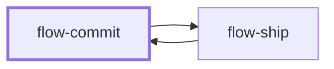

# flow-commit

> Generated by `pnpm docs:gen` from `skills/flow-commit/SKILL.md` - do not edit by hand.

_Write a conventional commit message for the intended change, or stage and create an atomic commit when asked. Message-only requests never mutate Git. Hands off to `flow-ship` when push or a pull request is part of the request._

**Stage:** deliver · [full graph](../SKILL-MAP.md)

---

# Commit

Make one logical change understandable from history. A message draft, permission to commit,
and pushing or opening a PR are separate outcomes.

## Process

1. Inspect branch, status, staged, unstaged and relevant untracked changes. Read the index with
   `git diff --cached`; `git diff` alone misses staged content. Preserve unrelated staging and
   working files.
2. Group changes by intent. Keep tests, generated artifacts and docs with the behavior they
   support; don't split an inseparable change to shrink file count.
3. Conventional subject: `type(scope): imperative description`, following the repository's
   types, scopes, length and language. Describe the effect, not a file list.
4. Body: the why when not obvious, plus constraints, significant tradeoffs and breaking-change
   migration notes. Never invent rationale or claim unrun checks. Follow the repository's
   Co-Authored-By / generated-credit convention.
5. Message-only request: return the message and stop. Authorized commit: stage only intended
   paths/hunks. Use `git add -p` when interactive; in a noninteractive host use scoped paths or
   inspected patches rather than hanging.
6. Inspect the final index, run the required gate, commit with hooks enabled. A failed plain
   commit creates nothing, so a retry must not amend the previous good commit. After an
   interrupted explicit amend, check HEAD before retrying.
7. Verify commit contents and remaining worktree. Report SHA and scope; never claim it is
   pushed without remote confirmation.

## Anti-patterns

- `git add .` with unrelated changes in the index or working tree.
- Mutating Git for "write me a commit message".
- Bypassing hooks, weakening checks, or amending an unrelated commit after a failure.
- Shell-interpolating a multi-line message; use a file or structured argument.

## Done when

- The message describes one logical change and its reason.
- If committing was requested, the commit matches the intended scope, passes required checks,
  and unrelated changes are preserved.

Use `flow-ship` only for delivery actions already in the user's request.
