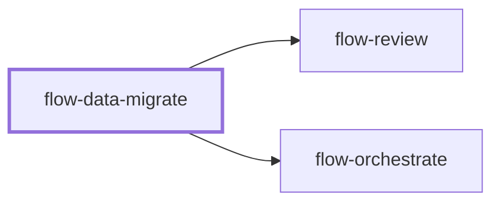

# flow-data-migrate

> Generated by `pnpm docs:gen` from `skills/flow-data-migrate/SKILL.md` - do not edit by hand.

_Database schema and data migrations. Use when changing stored data, adding constraints or running a live backfill. Hands off to `flow-review` or `flow-orchestrate`._

**Stage:** build · [full graph](../SKILL-MAP.md)

---

# Data migration

Change persisted data while keeping every supported reader and writer correct. A completed
job is not proof of a completed migration. Code-only transformations belong to `flow-migrate`.

## Phase 1: Establish the data contract

- Inspect the actual engine and version, schema, migration mechanism, volume, indexes,
  constraints and all readers and writers, including older deployments and background jobs.
  Do not choose engine-specific syntax or promise a completion time from assumed capabilities
  or throughput. Measure a representative batch before estimating.
- Define the source of truth, transformation version, invariants, invalid-row policy and
  acceptance queries. Preserve identifiers, precision and null semantics. A placeholder value
  cannot make missing or invalid data correct merely by satisfying a constraint.
- Establish the authorized environment and terminal action. Preparing a migration does not
  authorize running it on live data. Reuse authorization already given.

## Phase 2: Make compatibility and recovery explicit

- Separate expand, backfill, cutover and contract. Record which application versions can read
  and write each intermediate schema; keep the old representation until its consumers retire.
- Specify how writes during the backfill reach both representations. Dual writes only in new
  application code do not cover old writers. Define conflict detection and retry without
  overwriting newer values, and a final catch-up under the chosen consistency boundary.
- Check actual lock and rewrite behavior. Use bounded transactions where supported; some
  operations cannot run in a transaction. Set measured batch limits, lock/wait limits, load
  signals and pause thresholds from the environment's operating budget.
- Name a recovery path per phase: application rollback, data repair, forward fix or restore.
  Verify the recovery mechanism on a disposable copy, including preservation or reconciliation
  of writes since the backup. A down migration is not proof that lost data can be recovered.

## Phase 3: Execute a resumable transformation

- Rehearse against representative disposable data, including malformed values and concurrent
  updates. Implement idempotent batches with stable traversal, a defined population boundary
  and durable checkpoints. Advance a checkpoint only with or after its batch commits.
- Record committed, failed, skipped and retried rows; reconcile them against the population.
  An interrupted or ambiguous batch is inspected before retry. Retry limits and pause state
  survive restarts. Avoid storing sensitive row payloads in progress logs.
- Exercise interruption and restart, repeated execution, concurrent old/new writes and a
  failed batch. Verify these cases before proceeding to an authorized live run.

## Phase 4: Reconcile and cut over

- Compare source and target values using the pinned transformation, not just non-null counts
  or a dashboard's success flag. Account for concurrent writes, rejects and omitted rows.
- Enforce constraints and switch readers only after compatibility and reconciliation pass.
  Check the actual constraint state and application behavior, plus load, errors and lag.
- Remove old storage and compatibility support only after all dependent consumers retire and
  the agreed recovery window closes. Record the verified revision, data boundary, queries,
  unresolved rows and the next phase that is actually safe to run.

## Anti-patterns

- One large update with no measured load budget or durable restart point.
- Treating an initial copy as current while older instances still write the source.
- Requiring a transaction or reversible down migration regardless of engine capabilities.
- Dropping old data because the new column is populated or the deployment began.

## Done when

- The requested phase is complete with value-level reconciliation and compatibility evidence.
- Restart and recovery were exercised; remaining failures and unrun live steps are explicit.
- Destructive contraction has its own satisfied prerequisites and existing authorization.

Use `flow-review` for the migration diff or `flow-orchestrate` for dependent rollout phases;
when unavailable, perform the equivalent review or record the remaining phase contract.
