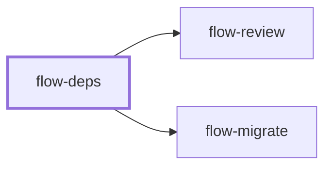

# flow-deps

> Generated by `pnpm docs:gen` from `skills/flow-deps/SKILL.md` - do not edit by hand.

_Update dependencies using current release guidance, compatible upgrade groups, coherent lockfiles and verified installs. Use for bumps, advisories or framework upgrades. Hands off to `flow-review` or `flow-migrate`._

**Stage:** build · [full graph](../SKILL-MAP.md)

---

# Dependencies

Reach supported versions with a reproducible install and a clear compatibility story. Latest
is a candidate, not proof the repository can adopt it unchanged.

## Process

1. Discover package manager, lockfile, engines, workspace layout and upgrade policy. Record
   existing check failures so an upgrade is neither blamed for nor credited with them.
2. Inventory outdated direct dependencies, relevant transitive constraints and advisories from
   current registry/vendor data. Read each changelog and migration guide for breaking changes,
   runtime requirements, peer ranges, renamed APIs and codemods. Never guess release notes.
3. Upgrade one compatibility group at a time: tightly coupled packages such as framework and
   renderer, test runner and coverage provider, compiler and its tooling. Keep independent
   majors separate, but never gate halfway through a vendor-required paired upgrade.
4. Change manifests and the lockfile through the package manager, respecting pinning policy.
   Never hand-edit resolution/integrity data, bypass peer checks or disable verification.
   Review unexpected transitive or install-script changes.
5. Apply documented migrations, then run targeted behavior checks, repository gates and a
   frozen install. Patch/minor labels don't replace verification.
6. Report each group updated with evidence and behavior changes, and anything held back with
   its compatibility reason and unblock condition. Don't claim the whole graph is current from
   a top-level check.

## Anti-patterns

- Blind bulk major updates with no migration or engine/peer inspection.
- Installing an unavailable version.
- Silently pinning an old dependency, or treating an unrun check as green.

## Done when

- Manifest and lockfile agree and the intended groups install reproducibly.
- Relevant behavior and required checks run on the updated graph.
- Holds, baseline failures and unverified compatibility are explicit.

Use `flow-review` for the upgrade diff or `flow-migrate` for a separately scoped API transformation.
