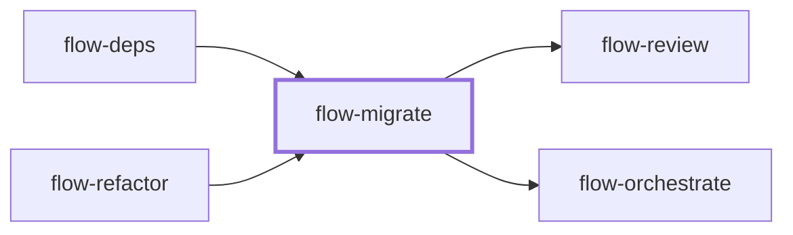

# flow-migrate

> Generated by `pnpm docs:gen` from `skills/flow-migrate/SKILL.md` - do not edit by hand.

_Apply a known API or pattern transformation across a repository with a site inventory, variant handling and per-site evidence. Use for repetitive cross-file migrations or codemods. Hands off to `flow-review` or `flow-orchestrate`._

**Stage:** build · [full graph](../SKILL-MAP.md)

---

# Migrate

Prove one canonical transformation, then account for every affected site. The migration is
complete when its inventory reconciles, including intentional exceptions.

## Process

1. Read the target contract, supported versions, consumers and repository gates. Record the
   baseline and preserve dirty work. For broad changes use an isolated branch or worktree
   started from the correct revision, carrying any required uncommitted inputs.
2. Enumerate actual sites and variants before editing. Separate source from generated output,
   dynamic/config uses and external consumers. Record the denominator so progress means more
   than "many files changed".
3. Implement one canonical example; verify its behavior, failure path and callers. Note
   variants that cannot safely share the rewrite.
4. For mechanical repetition, prefer a pinned parser or codemod when syntax demands it; use a
   narrow text transform only when its preconditions make it reliable. Preview the diff and
   check idempotency when reruns are expected.
5. Apply in bounded groups. Parallel workers need disjoint file ownership and separate
   worktrees when available and authorized; shared files and lockfiles need serialized writes.
   Each worker returns per site outcomes and evidence before integration.
6. Run project-aware checks with the real configuration, not a standalone compiler call that
   ignores tsconfig or equivalent. Verify integrated interfaces and any expand/migrate/contract
   compatibility stages.
7. Search for residual old patterns and reconcile every site: migrated, intentionally retained,
   not applicable, or blocked with a reason. Remove old support only when consumers allow it.

## Anti-patterns

- A global replace before validating a representative case and its variants.
- Editing generated files instead of generators, or missing dynamic consumers.
- Declaring a sweep done without a denominator and residual search.
- Merging unverified parallel changes and assuming isolated green tests cover integration.

## Done when

- The inventory accounts for every site and exception.
- The canonical transformation and integrated result meet the compatibility contract.
- Required checks and blocked consumers are recorded at the current revision.

Use `flow-review` for the completed diff or `flow-orchestrate` for further dependent migration phases.
