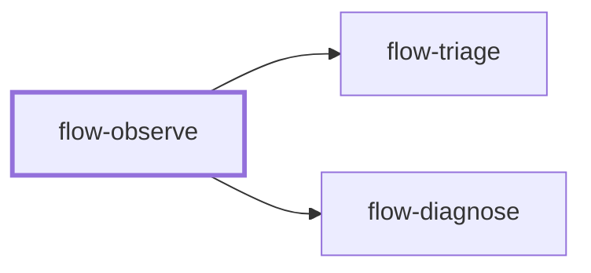

# flow-observe

> Generated by `pnpm docs:gen` from `skills/flow-observe/SKILL.md` - do not edit by hand.

_Observability for a service or feature: structured logs, metrics, traces and alerts tied to user impact. Use when adding telemetry or alerts, before a launch, or after an incident lacked signal. Feeds `flow-triage` and `flow-diagnose`._

**Stage:** operate · [full graph](../SKILL-MAP.md)

---

# Observe

Instrument so that the next failure is detected by a signal, not a user, and can be explained
from the data without a redeploy. Every signal needs a question it answers.

## Phase 1: Define what matters

- Name the user-facing outcomes and the questions an on-call engineer will ask: is it working,
  for whom is it failing, since when, and where in the path.
- Pick a few service-level indicators from those outcomes (success rate, latency percentiles,
  freshness, correctness), with targets when the team uses them.
- Read the existing telemetry stack, libraries, naming conventions and dashboards. Extend them;
  do not add a second logging or tracing library.

## Phase 2: Instrument the path

- **Logs:** structured events at decision points and boundaries, with a correlation or trace ID,
  stable field names and levels that mean something. Log failures with the context to act on
  them. Never log secrets, tokens or personal data; redact at the source.
- **Metrics:** rate, errors and duration for requests, plus saturation for queues, pools and
  resources. Keep label cardinality bounded: no user IDs, raw URLs or free text as labels.
- **Traces:** propagate context across process, queue and service boundaries, and span the slow
  or failure-prone steps, using the project's standard (for example OpenTelemetry) when present.
- **Business and job signals:** counts for key outcomes, and heartbeats or last-success timestamps
  for scheduled work that can fail silently.

## Phase 3: Alert on symptoms

- Alert on user-visible symptoms and burn against targets, not on every cause. Each alert names
  its impact, a threshold with a reason, and a runbook or first diagnostic step.
- Route by severity: page for urgent user impact, ticket for slow degradation.
- Build or update one dashboard that answers the Phase 1 questions in order.

## Phase 4: Prove the signal

Trigger the failure in a safe environment (bad input, a stopped dependency, an injected delay)
and confirm the log, metric, trace and alert each show it with enough context to diagnose.
Check volume and cost of new telemetry. Without a runnable environment, state which signals are
unverified.

## Anti-patterns

- Logging everything at info and calling it observability.
- Alerts nobody can act on, or thresholds copied without a reason.
- High-cardinality labels that explode metric cost.
- Personal data or credentials in logs, traces or error reports.

## Done when

- The on-call questions can be answered from the signals for a triggered failure.
- Alerts have impact, thresholds, routing and a first step.
- Telemetry follows existing conventions, with privacy and cardinality checked.

Use the signals in `flow-triage` and `flow-diagnose` when something breaks.
