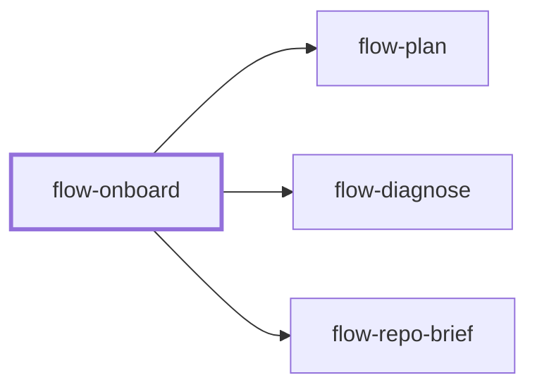

# flow-onboard

> Generated by `pnpm docs:gen` from `skills/flow-onboard/SKILL.md` - do not edit by hand.

_Map an unfamiliar repository: discover commands, trace one real flow, and note ownership, conventions, and constraints. Use for a first codebase tour, not maintained context (`flow-repo-brief`). Hands off to `flow-plan`, `flow-diagnose`, or `flow-repo-brief`._

**Stage:** understand · [full graph](../SKILL-MAP.md)

---

# Onboard

Build enough of a map to place the next change confidently. Explore breadth-first, then go deep on one representative flow instead of reading every file.

## Process

1. Read instructions, README, manifests, lockfiles, and CI. Find how to build, run, test, and lint, and the real entry points. Inspect scripts before running them so database resets, installs, or external actions are not mistaken for read-only checks.
2. Run relevant permitted commands. Record verified, failed, and unrun commands separately with reasons. Missing credentials limit runtime claims, not the source-based map.
3. Trace one real flow end to end: entry, routing, domain logic, storage or integration, result. Cite files and symbols at each boundary. Do not infer architecture from directory names.
4. In a large repository, when authorized and available, assign independent read-only subsystem explorers. Ask each for purpose, key files and types, connections, and landmines in one compact shape. Small repositories need no fan-out.
5. Distil the map to the files the next task needs, with conventions, invariants, ownership, and open questions. Separate enforced rules from observed precedent.
6. Write the map to the user's location or the repository's knowledge convention. Use `flow-repo-brief` when it needs citations, freshness tracking, and reuse across sessions.

## Anti-patterns

- Calling source-based understanding runtime verification.
- Running setup scripts that mutate external services.
- Listing every file instead of tracing useful boundaries.
- Blocking the whole map because one environment-dependent command cannot run.

## Done when

- Main commands and their verification status are known.
- One real flow and its ownership boundaries are mapped with source locations.
- The next task's conventions, landmines, and uncertainty are captured.

Continue with `flow-plan`, `flow-diagnose` for a specific bug, or `flow-repo-brief` for maintained context.
