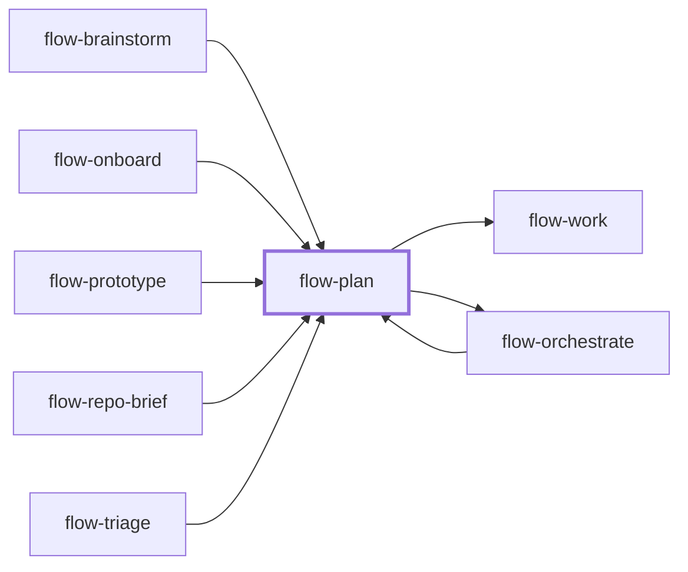

# flow-plan

> Generated by `pnpm docs:gen` from `skills/flow-plan/SKILL.md` - do not edit by hand.

_Turn a defined outcome into a source-grounded plan with dependency-ordered tasks, acceptance criteria, evidence and stop conditions. Use for multi-change or multi-session work; small edits go to `flow-work`. Hands off to `flow-work` or `flow-orchestrate`._

**Stage:** plan · [full graph](../SKILL-MAP.md)



---

# Plan

Make the next action decidable from an artifact. Research and design here; change production
code only when implementation is part of the request and the plan is ready.

## Phase 1: Establish intent and evidence

- Read the user's scope, repository instructions, relevant source, tests and executable config.
  Reuse a current `flow-repo-brief` if available.
- Identify precedent, constraints, blast radius and the smallest behavior the user needs.
- Use read-only explorers only for genuinely independent research when available and
  authorized; a few relevant files do not need a team.
- Resolve conflicting findings against source. Separate facts, assumptions and hypotheses, and
  record what evidence would falsify each risky assumption.
- Ask only about ambiguity whose answers change the outcome; settle routine choices from the repo.

## Phase 2: Design and decompose

- Describe entry points, data flow, ownership boundaries, interfaces, failure behavior, and
  any migration or rollout. Preserve existing architecture unless the outcome requires change.
- Prefer a vertical slice that demonstrates value at each step.
- Give each task an ID, dependencies, bounded write set, deliverable and observable acceptance.
- Name the exact check and expected result, not "run tests". Include required lint, format,
  type, docs and runtime gates. Use pragmatic verification for decision artifacts and
  production verification for shipping code.
- Task counts and estimates are guidance, never a reason to omit necessary work. Split when
  scope cannot be verified independently; merge artificially separate tasks.

## Phase 3: Persist the contract

Write to the user's location or `.plans/<YYYY-MM-DD>-<slug>.md`. Preserve ignore and tracking
policy: an ignored file stays local unless shared. Do not edit `.gitignore` or instruction files
just to write a plan.

```markdown
# Plan - <goal>
**Created:** YYYY-MM-DD
**Status:** ready
**Execution:** direct | orchestrated
**Revision:** <plan revision>
**Repository:** <commit and relevant dirty/untracked state>
**Limits:** <attempt, concurrency and elapsed-time bounds; approved budget if needed>

## Goal and non-goals
<Observable user outcome, scope boundaries, authorized external actions.>

## Research and design
<Source paths/symbols, key decisions, data flow, assumptions and how to test them.>

## Tasks
- [ ] **T1 - <verb-led task>**
      Depends on: none
      Touches: <owned files/areas>
      Artifact: <deliverable>
      Acceptance: <observable expected behavior>
      Verify: <verification profile, command + cwd / evidence, expected result>
      Stop: <scope conflict, missing prerequisite, finite correction budget>

## Integrated acceptance
<Checks proving the combined result satisfies the user outcome.>

## Risks and open decisions
<Unresolved consequential questions, not guessed requirements.>
```

For orchestrated plans or plans that request worker/verifier models and effort, read
[orchestration fields](references/orchestration-fields.md) and add its limits and execution
lines. For direct work, `flow-work` records evidence beside each completed task. Existing simple
plans with Acceptance, Touches and Depends on stay usable; fill missing material criteria
before execution instead of forcing a cosmetic schema migration.

## Phase 4: Check readiness and hand off

- Walk the dependency graph: no cycles or missing IDs, no consumer before its producer, no
  parallel ownership conflict.
- Every acceptance must be assessable without guessing intent. If a consequential decision is
  unresolved, mark the plan blocked and name the question.
- A fresh session is optional when research crowded the context; the written plan also supports
  continuing here. Current user steering beats an older plan.
- If execution is already requested, continue through the right skill without asking again.

## Anti-patterns

- A generic task list that cites no code and defines no downstream acceptance.
- Requiring a fixed number of tasks, agents, or a fresh session for every change.
- Silently expanding scope or inventing new architecture while decomposing.
- Calling an ignored plan portable without making it available to the next session.

## Done when

- The plan exists, scope and uncertainty are explicit, and dependencies are coherent.
- Every task and the integrated outcome has a concrete completion check.
- The next executor can start without redoing research or guessing material requirements.

Name the plan path and use `flow-work` or `flow-orchestrate` according to its execution mode.

---

Supporting files, loaded on demand:

- [references/orchestration-fields.md](../../skills/flow-plan/references/orchestration-fields.md)
