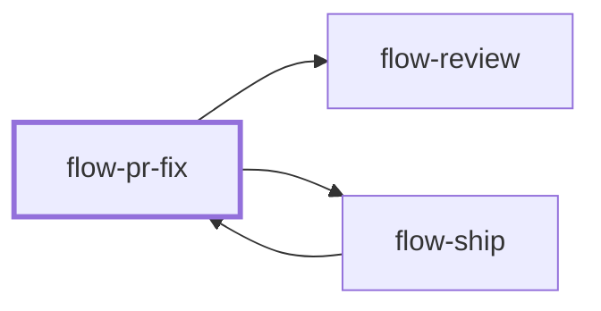

# flow-pr-fix

> Generated by `pnpm docs:gen` from `skills/flow-pr-fix/SKILL.md` - do not edit by hand.

_Pull-request review feedback and failing checks. Use when a PR has review comments or red CI; push, replies and thread resolution stay within what the user authorized. Hands back to `flow-review` or `flow-ship`._

**Stage:** deliver · [full graph](../SKILL-MAP.md)

---

# Fix PR feedback

Map every thread with actionable feedback to a disposition and evidence. Never announce or resolve a fix reviewers cannot see on the published revision.

## Process

1. Resolve the exact repository and PR, base and head, current commit SHA, and local work state. Read the description, reviews, threads, and checks, following pagination. Track resolved, outdated, and already-addressed feedback so reruns do not duplicate replies.
2. Normalize conversations:
   - Keep the root review comment ID separate from the GraphQL thread ID. Review replies target the root comment, never another reply.
   - Issue comments and review threads are different channels.
   - Use connected tools or `gh api` only when available and authorized, with current API shapes.
3. Group by intent and classify each item: fix, already fixed, needs evidence, disagreement, or out of scope. Restate each suggestion and check it against the code before agreeing; a reviewer can be wrong, and a technically grounded pushback beats a silent bad change. A type annotation does not validate runtime input: before removing a guard, trace where the value comes from (files, network, users). Collect every unclear item and ask about them together before implementing any. Resolve reviewer conflicts against contracts and source.
4. For failing checks, read the actual job log on the current head, reproduce locally where possible, and separate real failures from flaky or infrastructure ones. Fix the cause; never skip, mute or loosen a check to get green.
5. Make logical changes, preserving unrelated staging and work. Run relevant tests and repository gates; review substantive behavior changes. Keep unsquashed fix commits when review practice needs traceability; do not rewrite public history by default.
6. Build a response map: thread and root ID, disposition, exact change, commit or file evidence, validation. A local-only request ends here with local fixes and reply drafts.
7. When publishing is authorized, push and confirm the remote head contains the fix. Only then, if replies or resolution are also authorized, post concise evidence-backed responses and resolve fully addressed threads. Leave disagreements and missing evidence open. After an uncertain response, check whether the action succeeded before retrying.
8. Re-fetch the PR and confirm what is published, answered, resolved, or pending. Judge checks on the latest head, not an earlier green commit.

## Red flags

- "The reviewer is right, it's a quick change": verify it against the code first.
- "The type says it can't be null": check the runtime source of the value.
- "I'll guess what they meant": ask about every unclear comment together, before editing.

## Anti-patterns

- Replying "fixed" with an unpublished SHA, or resolving before a push succeeds.
- Treating every historical thread as new work, or replying to a reply ID.
- Accepting every suggestion without checking the behavior contract, or performative agreement before verifying.
- Sending comments or reviewer notifications just because code changes were authorized.

## Done when

- Every thread with current actionable feedback has a clear disposition.
- Requested fixes are verified and their publication status is accurate.
- Authorized replies and resolutions cite visible evidence; disagreements stay open.

Use `flow-review` for affected behavior or `flow-ship` for the remaining authorized delivery action.
