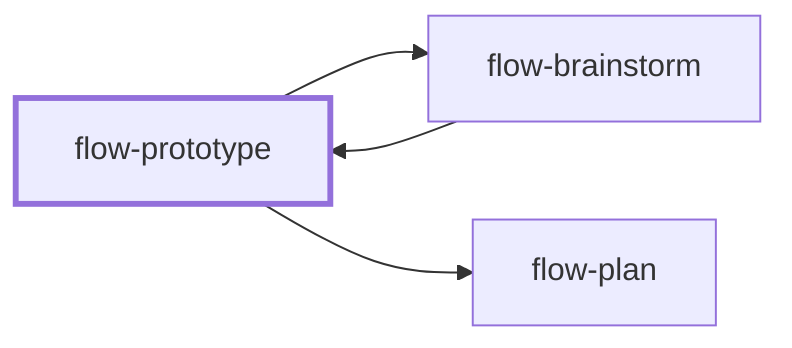

# flow-prototype

> Generated by `pnpm docs:gen` from `skills/flow-prototype/SKILL.md` - do not edit by hand.

_Build a small runnable experiment (script, demo, or visual alternatives) that answers one technical or UX question before committing to production design. Use for spikes and proofs of concept. Hands off to `flow-brainstorm` or `flow-plan`._

**Stage:** explore · [full graph](../SKILL-MAP.md)

---

# Prototype

Answer one question with a runnable artifact. Default to throwaway work, but let the user retain or promote useful code once its limits are assessed.

## Process

1. Define the question, hypothesis, observation, and stop condition. Budget effort in proportion to the uncertainty. Reuse the existing stack when it fits; no new framework for a small demo.
2. Isolate the artifact from production navigation, data, and deployment. Use the user's directory or the repository's prototype convention. Do not change ignore rules automatically.
3. Pick the shape:
   - A terminal app or script for data flow, algorithms, protocols, and state machines.
   - A visual route or demo for layout, motion, and interaction. Show a few meaningfully different alternatives side by side when comparison is the point.
4. Build only the paths the answer needs, including validation and failure behavior where they affect it. Minimal does not mean crashing or empty handlers. No fixed file-count rule should block components the experiment needs.
5. Run it. Record the startup command, representative inputs, and observed outcomes. Inspect visual prototypes in the browser, including interaction and final state; code reading does not confirm experience. Mark unavailable checks.
6. Compare evidence to the hypothesis. State what it demonstrates and what it does not: mocked services, assumed data, missing operational behavior.
7. Record disposition: keep, archive, discard, or promote. An explicit request to build on it overrides the throwaway default. For promotion, define production requirements and gaps through `flow-plan` instead of an automatic rewrite.

## Anti-patterns

- Building a whole product to answer a narrow uncertainty.
- Omitting error paths essential to the question.
- Presenting mocked success as proof of a real integration.
- Forcing the user to discard code they chose to retain.

## Done when

- The artifact runs, and the question has an evidence-backed answer or a named limit.
- Someone else can reproduce the experiment.
- Location, limitations, and disposition are clear.

Return the answer to `flow-brainstorm` or use `flow-plan` for the production work the user requests.
