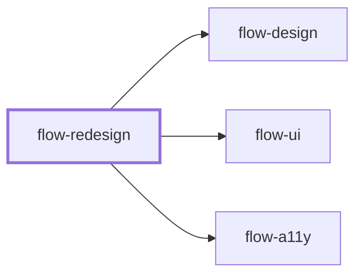

# flow-redesign

> Generated by `pnpm docs:gen` from `skills/flow-redesign/SKILL.md` - do not edit by hand.

_Audit an existing interface with screenshots and a scored rubric, then upgrade it in prioritized steps that preserve behavior, URLs and content contracts. Use to modernize or polish shipped UI. Hands off to `flow-design`, `flow-ui` or `flow-a11y`._

**Stage:** build · [full graph](../SKILL-MAP.md)

---

# Redesign

Improve what exists without breaking what works. Measure first, change in small reversible steps,
and prove each step made things better.

## Phase 1: Classify and baseline

- **Mode:** *polish* (keep the system, fix execution), *refresh* (evolve tokens and components),
  or *overhaul* (new direction through `flow-design`). Default to the least disruptive mode that
  meets the goal, and confirm an overhaul with the user.
- **Baseline:** screenshots of key pages at 375, 768 and 1280 in each theme, key states, and any
  available metrics (Core Web Vitals, accessibility scan results, analytics goals).
- **Contracts to preserve:** URLs and routes, navigation labels, form field names and order,
  analytics and test IDs, SEO titles and metadata, logo and legal copy. Change one only when asked,
  and list it.
- **Stack:** framework, styling approach, component library and tokens. Work inside them; never
  migrate frameworks or styling systems as part of a redesign.

## Phase 2: Audit

Score each dimension 1 to 5 with evidence (screenshot, selector, measured value) using
[references/audit-rubric.md](references/audit-rubric.md): hierarchy, typography, color and
contrast, layout and spacing, components and consistency, states, responsiveness,
accessibility, performance, and content. Check the generic tells from `flow-design`.

Turn findings into a punch list: issue, evidence, impact, effort, risk. Order by impact over
effort, and keep risky or cross-cutting changes for last.

## Phase 3: Upgrade in steps

Work in this order, because each step makes the next one cheaper and less risky:

1. **Tokens:** type scale, color roles, spacing and radius, fixed at the source so every screen improves.
2. **Typography and spacing:** hierarchy, line length, vertical rhythm, alignment.
3. **Color and surface:** one accent, consistent neutrals, contrast in every theme, elevation only where meaningful.
4. **Components and states:** shared components first; add missing hover, focus, loading, empty and error states.
5. **Layout and composition:** replace generic sections only where the content deserves a better structure.
6. **Motion and detail** last, and only with a purpose.

After each step, re-render the baseline screenshots, run the repository checks, and confirm the
preserved contracts still hold. Keep steps small enough to review and revert on their own.

## Phase 4: Report

Show before and after screenshots per step, the rubric re-scored, contracts confirmed unchanged,
and the punch-list items deferred with reasons.

## Anti-patterns

- Rewriting from scratch when targeted fixes would do.
- Restyling one page while the shared components and tokens stay broken.
- Swapping fonts, icon sets or libraries without checking licensing, loading cost and existing usage.
- Silently renaming routes, labels or form fields.
- Declaring it better without a before-and-after comparison.

## Done when

- The punch list's in-scope items are done, each with before-and-after evidence.
- Rubric scores improved on the targeted dimensions and none regressed.
- Preserved contracts are verified, and deferred items are listed with reasons.

Set a new direction with `flow-design`, build new surfaces with `flow-ui`, and finish with `flow-a11y`.

---

Supporting files, loaded on demand:

- [references/audit-rubric.md](../../skills/flow-redesign/references/audit-rubric.md)
