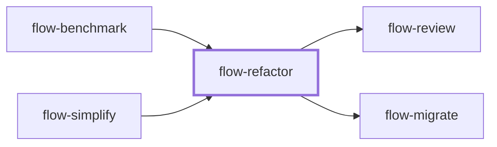

# flow-refactor

> Generated by `pnpm docs:gen` from `skills/flow-refactor/SKILL.md` - do not edit by hand.

_Improve code structure (extract responsibilities, reduce coupling, clarify ownership) while preserving observable behavior and public contracts. Intentional behavior changes belong in `flow-work`. Hands off to `flow-review` or `flow-migrate`._

**Stage:** build · [full graph](../SKILL-MAP.md)

---

# Refactor

Change structure inside an explicit behavior boundary. Preserve outputs, errors, ordering, state lifetime, and public compatibility unless the user also requests those changes.

## Process

1. Define the structural problem, affected callers, and observable contract. Read source, conventions, and relevant tests before choosing an abstraction.
2. Build a safety net proportional to the change: existing tests, characterisation tests, boundary fixtures, traces, or static reference checks. A private rename may need no new test; a hard I/O boundary may need a small harness. Do not extract a new architecture just to create the net meant to protect that extraction.
3. Choose a small transformation that improves ownership or makes a module deeper without growing public surface. Similar syntax is not always the same responsibility; semantic reasons beat duplicate counts.
4. Apply reversible steps and compare behavior after each meaningful boundary change. Keep a single-writer rule per file and index. Parallel read-only inspection is fine; parallel implementation needs disjoint ownership and integration checks.
5. Preserve API consumers, serialization, component identity, effect cleanup, module side effects, and runtime guards at untrusted boundaries. A type annotation does not validate a runtime value. Regenerate generated output through its source tooling.
6. Verify affected callers and repository gates on the integrated result. Keep any requested behavior change separate in the diff and explain it.

## Anti-patterns

- Turning a structural fix into a new framework or domain architecture.
- Adding abstractions only because code appears twice.
- Treating fewer lines or unrelated green tests as proof of preserved behavior.
- Scope creep into adjacent features, or deleting user changes for a clean worktree.

## Done when

- The structural problem improves and the behavior boundary is backed by evidence.
- Affected consumers and repository gates pass at the current revision.
- The change follows local conventions, stays in scope, and single-writer ownership is clear.

Use `flow-review` for the result or `flow-migrate` when applying a proven transformation across sites.
