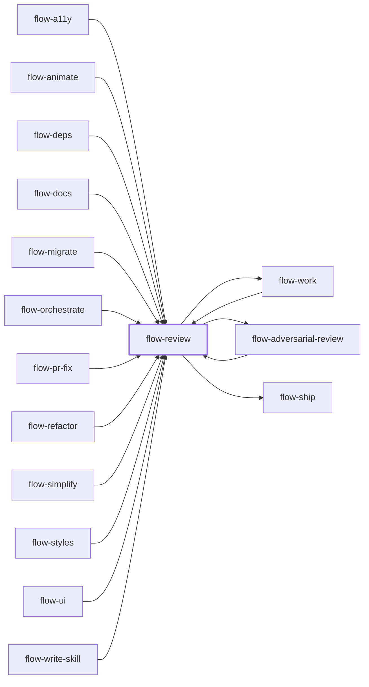

# flow-review

> Generated by `pnpm docs:gen` from `skills/flow-review/SKILL.md` - do not edit by hand.

_Code review with evidence-backed correctness and maintainability findings. Use before shipping, on a PR, MR or diff, or when asked to review; gates belong in `flow-verify`. Routes to `flow-work`, `flow-adversarial-review` or `flow-ship`._

**Stage:** verify · [full graph](../SKILL-MAP.md)

---

# Review

Find defects a maintainer can act on, within the requested scope. Separate confirmed bugs from
plausible risks and refuted claims.

## Phase 1: Pin the change

- Use the supplied change request, base or commit. Otherwise resolve the default branch and merge base from
  repository metadata; do not assume `main` or a remote name.
- Review committed, staged, unstaged and relevant untracked changes as separate layers. When
  staged and unstaged versions diverge, inspect both: the staged one is what a commit publishes.
- A whole-repository audit request reviews that scope instead of returning "no diff".
- Record the inspected revision, assumptions and anything inaccessible.

## Phase 2: Choose the lenses

Correctness is the baseline. Add a persona only when the change warrants it: security for
trust-boundary changes, architecture for ownership/API changes, performance for hot paths,
readability for maintenance risk. A small diff needs one reviewer; no fixed panel size.

For large independent surfaces, delegate bounded read-only reviewers in parallel (by persona or
file shard) with one findings schema, each in its own context. Reviewers may run isolated checks but never edit the source under
review. Without independent agents, state that this was a single-reviewer pass.

## Findings schema

- Location: file, symbol/line, inspected revision/layer.
- Lens and severity: blocking | should-fix | optional.
- Claim, and the scenario (inputs/state) that reaches a wrong outcome.
- Evidence: reproduction, source proof, or the unresolved premise.
- Correction: smallest useful direction, not a demanded redesign.

Drop preferences with no practical consequence unless style feedback is requested. Required
formatter/linter failures are repository gates, not taste.

## Phase 3: Challenge findings

Deduplicate by defect and scenario (distinct defects on one line stay separate). Try to refute
each candidate with caller contracts, guards, types, tests and reachability. Types do not prove
external JSON, storage, DOM or network data meets a runtime invariant. Send consequential or
disputed findings, batched, to an independent verifier when available. Classify:

- **CONFIRMED:** reproduced or proven reachable with a concrete wrong result.
- **PLAUSIBLE:** a specific risk remains, but necessary evidence is unavailable.
- **REFUTED:** a named guard, contract or reproduction disproves the scenario.

Never promote PLAUSIBLE to confirmed or drop it as refuted. Only a demonstrated blocker is a
confirmed blocking defect; if uncertainty stops a required gate, report the gate as blocked.

## Phase 4: Report and close

Lead with findings by severity, with file references and evidence. List checks performed,
scope not checked and material uncertainty. "No findings" is valid and does not certify unrun
tests. After later changes, reassess only the affected diff and invalidate stale findings.
In a coordinated run, return findings to the owner; edits and retry state stay with them.

## Red flags

- "This looks wrong": trace a concrete input to a wrong result, or tag it PLAUSIBLE.
- "The author probably handled it": find the guard or report the gap.
- "I should find something": no findings is a valid result.
- "Tests pass, so it's fine": check whether the tests cover the changed behavior.

## Anti-patterns

- A fixed six-persona ceremony for a small diff.
- Reporting suspicion as proven, or hiding a plausible unresolved risk.
- Treating no findings as deployment permission or production verification.
- Reviewing only the working tree when the staged artifact differs.

## Done when

- The requested scope is inspected with fitting lenses and revision context.
- Findings are deduplicated, confidence-tagged and backed by a falsifiable scenario.
- Checks and remaining uncertainty are explicit, with no padded findings.

Route fixes to `flow-work`, deeper attack analysis to `flow-adversarial-review`, and completed review
to `flow-ship` only within the user's delivery authorization.
