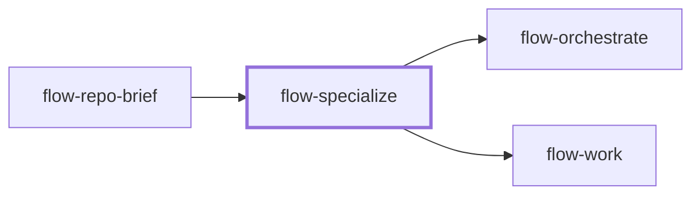

# flow-specialize

> Generated by `pnpm docs:gen` from `skills/flow-specialize/SKILL.md` - do not edit by hand.

_Write a repository-specific worker brief and matching verifier brief from inspected code, conventions, and a bounded task. Use when generic agents keep missing local architecture, lint rules, or domain contracts. Feeds `flow-orchestrate` or `flow-work`._

**Stage:** understand · [full graph](../SKILL-MAP.md)

---

# Specialize a worker

Turn repository evidence into a focused execution brief. Specialization supplies constraints and checks; it does not grant tools, register an agent, or override user scope.

## Phase 1: Establish the evidence

- Read the target task, repository instructions, configuration, and representative implementation and test files.
- Reuse a current `flow-repo-brief`, reopening sources for each relevant constraint. Resolve a stale brief or ambiguous task before writing a confident profile.
- Separate enforced rules from precedent and preference. Copy actual EditorConfig, Prettier, ESLint/Stylelint, type boundary, and documentation rules when present. Do not import DDD, a logging library, a build chain, or function syntax from another repo. Note deliberate local exceptions.

## Phase 2: Produce two bounded briefs

Write `worker.md` and `verifier.md` to the user's location or `.plans/specialists/<topic>/`. Keep roles separate and link shared evidence.

The **worker brief** includes:

- Purpose, matching task types, explicit exclusions.
- Repository revision, source citations, relevant files and symbols, input dependencies.
- Allowed write set and external actions; shared files that need coordination.
- Task-relevant conventions with provenance and exceptions.
- Deliverable, behavioral acceptance, exact local commands, evidence format.
- Stop conditions and the plan's correction budget; report scope conflicts.
- Output: actual changes and revision, checks and results, open questions, artifact path.

The **verifier brief** includes:

- The same unchanged acceptance criteria and downstream use.
- Independent read access to implementation, tests, and raw outputs.
- Pragmatic or production profile with relevant runtime and repository gates.
- A ban on changing deliverables or accepting worker claims without evidence.
- The `flow-verify` verdict format, including BLOCKED for missing prerequisites.

Never preload either role with the desired verdict or tell it to ignore defects. The verifier is not the worker prompt with "review" appended.

## Phase 3: Bind to the host

Default to portable Markdown briefs, usable by an available agent or by `flow-work` directly. Check existing specialists before adding a redundant role. Generate native agent files only when the user requests them for an identified host; then read [references/native-agents.md](references/native-agents.md).

## Phase 4: Exercise the specialist

When delegation is available and authorized, give the worker a small realistic task in an isolated fixture, and give a different verifier its raw result plus the contract. Keep expected answers out of the worker context. Fix only observed gaps in the briefs. Never touch production systems to test a prompt. Without an independent run, label the briefs untested.

## Anti-patterns

- A role that is "world-class senior engineer" plus generic best practices.
- Installing or registering agents when only a reusable brief was requested.
- Pinning a model or tool name without checking host support.
- Relaxing repository gates so a generated specialist succeeds.

## Done when

- Both briefs are grounded in current repository evidence and task scope.
- Write ownership, acceptance, stop conditions, and evidence outputs are explicit.
- Validation and host-registration status are reported accurately.

Hand the briefs to `flow-orchestrate` for coordinated work or `flow-work` for a bounded direct task.

---

Supporting files, loaded on demand:

- [references/native-agents.md](../../skills/flow-specialize/references/native-agents.md)
