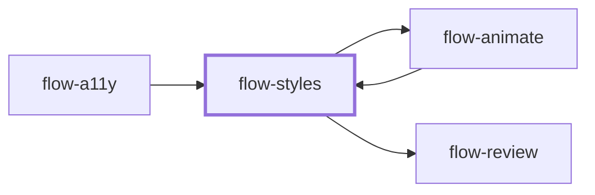

# flow-styles

> Generated by `pnpm docs:gen` from `skills/flow-styles/SKILL.md` - do not edit by hand.

_Implement or refactor CSS within the repo's styling architecture, browser targets and accessible states, verified in the rendered page. Use for layout, responsive, cascade and UI polish. Hands off to `flow-animate` or `flow-review`._

**Stage:** build · [full graph](../SKILL-MAP.md)

---

# Styles

Solve the visual problem inside the project's actual CSS architecture. Use newer features only
for a concrete benefit within the supported browser matrix.

## Phase 1: Inspect the design contract

Read the component, reference design, tokens, stylesheet organization, browser targets,
Prettier/Stylelint rules and nearby patterns. Keep the existing approach (plain CSS, modules,
utilities, CSS-in-JS, SCSS); never import another repository's naming or module conventions.

## Phase 2: Build deliberate layout and cascade

- Use existing tokens for shared values; keep one-off values local rather than inventing tokens.
- Prefer layout primitives, intrinsic sizing, logical properties, `gap`, `minmax()` and
  `aspect-ratio` over brittle coordinates. Account for long text, localization and zoom.
- Scope selectors; check specificity and source order. Add `@layer` only with a coherent
  strategy: unlayered normal styles beat layered ones and important-layer order reverses.
  Layers do not automatically fix a vendor override.
- Check support before nesting, container queries, `:has()`, `color-mix()`, view transitions or
  scroll-driven effects; add fallbacks or targeted `@supports` when needed. Parser support is
  not proof of bug-free behavior.
- Transition explicit properties; no `transition: all` or broad animation resets. Keep comments
  and directives that tools need.

## Phase 3: Preserve accessible and reduced-motion states

- Semantic controls, logical focus order, visible focus, sufficient contrast. Prefer
  `:focus-visible` with a fallback; never remove the only keyboard indicator. Content that must
  stay available to assistive technology uses a visually-hidden utility, not `display: none`.
- For `prefers-reduced-motion`, design a reduced or static presentation that keeps content and
  state changes. Handle infinite iteration, delays, animation callbacks and initially hidden
  elements explicitly; do not blindly shorten everything. Test with the preference on.
- Check hover, focus, active, disabled, error, empty, loading and forced-colors states as relevant.

## Phase 4: Measure and inspect

Use containment, `content-visibility` and rendering hints only for demonstrated performance
needs; containment can clip popovers and tooltips, so check anchors, scrolling and overflow.
Inspect the rendered page at representative widths, text lengths and zoom with stable data and
fonts. Exercise keyboard and pointer, compare with the reference, run lint/build. Without browser
access, name which visual and interaction claims remain unverified.

## Anti-patterns

- A catalog of trendy CSS features unrelated to the requested design.
- Global overrides that change unrelated components or remove focus.
- Treating a typecheck or source screenshot as rendered verification.
- Applying another project's SCSS/module conventions as universal rules.

## Done when

- The rendered change meets design and responsive requirements in supported targets.
- Interaction, focus and reduced-motion behavior are verified or explicitly unverified.
- Cascade and source follow local conventions without unrelated rewrites.

Use `flow-animate` for a motion pass, `flow-a11y` for a full accessibility audit, or `flow-review`
for implementation review. New screens start in `flow-ui`, new visual directions in `flow-design`.
