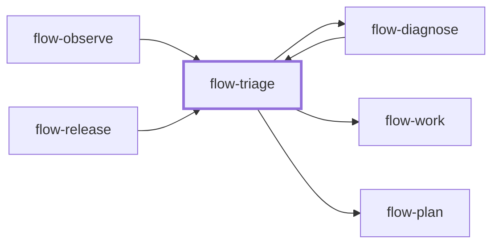

# flow-triage

> Generated by `pnpm docs:gen` from `skills/flow-triage/SKILL.md` - do not edit by hand.

_Incident and bug-report triage: severity, blast radius, containment and routing. Use for production incidents, firing alerts or unclear reports. Routes to `flow-diagnose`, `flow-work` or `flow-plan`._

**Stage:** operate · [full graph](../SKILL-MAP.md)

---

# Triage

Turn a noisy report into an actionable next step. Establish impact and evidence before assigning
urgency or prescribing a production action.

## Process

1. Capture expected vs observed behavior, affected users/data, onset, environment/revision and
   reproduction or traces. Note recent changes without assuming causation.
2. Assess blast radius, severity, duration and trajectory with the organization's incident
   scheme if one exists. Separate confirmed impact from plausible exposure and unknowns.
3. Look for reversible containment that reduces ongoing harm. Verify prerequisites, user
   authorization and operational rules before touching live state; read-only checks and
   preparation can proceed meanwhile.
4. If mitigation is authorized, apply it and verify health improved, recording the before/after
   signal and rollback condition. Otherwise report containment as pending or blocked.
5. Route the remaining problem: `flow-diagnose` for unknown cause, `flow-work` for a bounded understood
   fix, `flow-plan` for broader dependent work. A fix-now or later call needs a reason, owner or next
   action where known, and the evidence needed to resume.

## Anti-patterns

- Declaring severity from how alarming the report sounds.
- Unrequested deployment, rollback or data repair during triage.
- Equating a mitigation attempt with restored health.
- Filing vague later work that must be rediscovered.

## Done when

- Impact, uncertainty and containment status are explicit.
- The next actor has evidence, scope and a concrete route.
- Unresolved authorization or operational prerequisites are named.

Route to `flow-diagnose`, `flow-work` or `flow-plan` according to the evidence.
