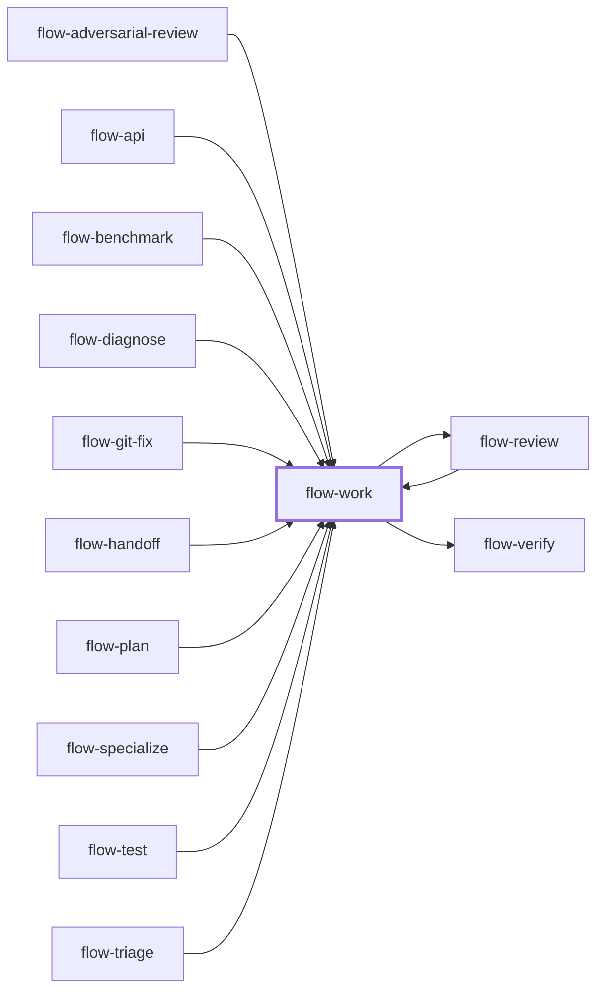

# flow-work

> Generated by `pnpm docs:gen` from `skills/flow-work/SKILL.md` - do not edit by hand.

_Implementation of a bounded change in verified slices. Use for most coding requests: features, changes, bug fixes or a plan task; multi-worker gated runs go to `flow-orchestrate`. Hands off to `flow-review`, or `flow-verify` via the coordinator._

**Stage:** build · [full graph](../SKILL-MAP.md)

---

# Work

Deliver one verified slice at a time, following repository conventions, with evidence proportionate to the change.

## Phase 1: Select the task

- An explicit plan path selects that plan. Read it and its referenced source. If the path is missing, stop; do not pick another plan.
- A description selects direct work, even when old plans exist.
- A bare invocation may select the only unfinished ready or in-progress direct plan. Ask if several are plausible. Orchestrated plans resume through `flow-orchestrate`.
- A coordinator's task brief selects delegated mode. Read [references/delegated-mode.md](references/delegated-mode.md) before editing.

Current user instructions override an older plan. Reconcile source drift before editing. A ready task has observable acceptance and satisfied dependencies. Report or verify already completed work instead of redoing it.

## Phase 2: Ground the implementation

- Read applicable instructions, nearby code and tests, configuration, and pinned dependency versions.
- Documented repository rules (JSDoc, comments, formatting, logging, lint) beat generic preferences.
- Resolve ordinary details from evidence; ask only about consequential missing choices.
- When unsure about an API, check official docs or the installed library source. Do not add a dependency or build chain because a generic example uses one.

## Phase 3: Implement and verify each slice

- New behavior or a bug fix with a stable contract: work tests-first where useful. Run the failing case, confirm the failure is relevant, implement, rerun.
- Risky rewrite of existing behavior: characterize the contract first.
- Reversible prose or low-impact style edits need no test that mirrors implementation.
- Verify in the runtime that carries the risk: browser interaction and visual inspection for UI, real CLI invocations for commands, API and data checks for integrations. Cover relevant failure, loading, empty, retry, and persistence states. Keep fixture data isolated.
- Record command, working directory, observed result, and artifact revision. A passing typecheck alone does not demonstrate behavior.
- Run required repository gates. Broaden checks only for affected dependents or a concrete unresolved risk.

## Phase 4: Report completion

- Before any "done", "fixed" or "passing" claim: name the check that proves it, run it fresh at this revision, read the full output, then state the result with that evidence.
- Direct plan mode: check off a task only after its acceptance is evidenced. Append a short evidence note and set Status to in-progress or done. If the plan requires independent acceptance, route through `flow-verify` first.
- Stay within owned scope. Inspect and preserve unrelated work in a required file; stop only when ownership or intent is unresolvable. Never stage a shared index another worker owns.

## When blocked

Refine a falsifiable hypothesis from the failure, shrink the reproduction, and use `flow-diagnose` for a hard cause. Honor the task's correction budget; without one, stop after three unsuccessful attempts without progress and report the evidence. Missing access or contradictory requirements need a named prerequisite, not retries. Never weaken tests or acceptance to pass.

## Red flags

Stop and gather evidence when you catch yourself thinking:

- "It should work now" or "that was a trivial change": run the check anyway.
- "The test is wrong": prove it against the contract before touching it.
- "I'll verify at the end": each slice gets its own evidence.
- "One more quick fix": after repeated failed attempts, step back to `flow-diagnose`.

## Anti-patterns

- Broadening a slice with opportunistic refactors or cleanup.
- Treating an unrun command or unavailable service as passing evidence.
- Asking to continue work the user already requested, or ignoring new steering.
- Completing a coordinator's plan task on the worker's own authority.

## Done when

- The slice works at the inspected revision and required checks have real results.
- Changes follow repository conventions and stay in scope.
- Direct work has a clear outcome; delegated work has a reviewable artifact, execution-profile evidence, and known gaps.

Continue to `flow-review` when the task requires it, or return to the coordinator for `flow-verify`.

---

Supporting files, loaded on demand:

- [references/delegated-mode.md](../../skills/flow-work/references/delegated-mode.md)
